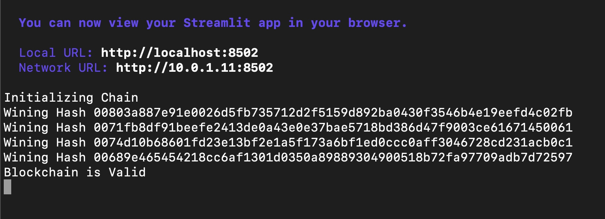

# This is module 18 
**Many thanks for teaching assistents' great effort**

---
**1. Pic Question1_a is adding block**

**2. Pic Question1_b is the right part of Question1_a**

---
**3. Pic Question2_a is True of validate**

**4. Pic Question2_b is the terminal part**

